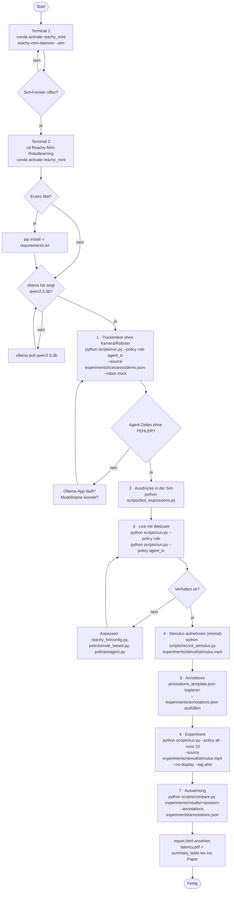

# Ablauf: Programm ausführen (Windows, nach dem Ollama-Setup)

## Hinweise

* **Ollama** läuft unter Windows als App im Hintergrund (Tray-Symbol). Test: `ollama run qwen2.5:3b "hallo"`.
* **Daemon** muss laufen, bevor `run.py` oder `test_expressions.py` startet. Ohne Daemon: `--robot mock`.
* **Webcam** nicht gefunden: `--source webcam:1` (oder 2) probieren.
* **Beenden**: im Videofenster `q`, sonst `Strg+C`.
* **Anderes Modell**: `--model qwen2.5:7b` (vorher `ollama pull qwen2.5:7b`).
* **Ergebnisse** landen in `experiments/results/<datum>_<tag>/`, je Policy und Lauf ein Ordner mit `events.csv`, `resources.csv` und `meta.json`.
