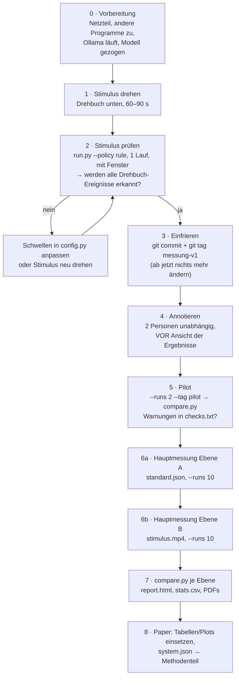

# Datenerhebung: Regeln vs. Agent

Das Programm misst automatisch. Jeder Lauf schreibt `events.csv` (Zeitstempel und
Entscheidung je Ereignis), `resources.csv` (CPU/RAM/GPU) und `meta.json`, jede Session
zusätzlich `system.json` (Hardware, Versionen, Git-Commit). **Aussagekräftig** werden die
Daten erst durch ein sauberes Protokoll: identischer Input, eingefrorene Konfiguration,
Wiederholungen, verschachtelte Reihenfolge.

## Überblick: zwei Messebenen

| Ebene | Input | Beantwortet | Befehl |
|---|---|---|---|
| **A · Entscheidungs-Benchmark** | `experiments/scenarios/standard.json` (36 skriptierte Ereignisse, ohne Kamera) | Reine Entscheidungslatenz, Ressourcen, Gültigkeit, Konsistenz, ohne Wahrnehmungsrauschen | `--source experiments/scenarios/standard.json` |
| **B · Ende-zu-Ende** | aufgezeichnetes Stimulus-Video, in Echtzeit abgespielt | Latenz vom Kamerabild bis zum Motorbefehl, Angemessenheit gegen Annotation, Einfluss der Agentenlast auf die Wahrnehmung | `--source experiments/stimuli/stimulus.mp4` |

Ebene A liefert die sauberen Vergleichszahlen, Ebene B die realistische. Beide ins Paper.

## Ablauf



### 0 · Vorbereitung (vor jeder Messsession)

* Laptop am **Netzteil**, Energiesparmodus auf „Höchstleistung“, andere Programme schließen
  (Browser, Teams, …). Alles, was CPU/GPU zieht, verfälscht die Latenz.
* Ollama läuft: `ollama list` zeigt das Modell. Modell **nicht** während der Messung wechseln.
* Daemon läuft (`reachy-mini-daemon --sim`), oder `--robot mock`, wenn nur Entscheidungen gemessen werden.
* Immer dieselbe Hardware für alle Bedingungen.

### 1 · Stimulus-Video drehen (einmal)

Drehbuch mit festen Zeitpunkten; jede Ereignisart **mehrfach**, damit pro Lauf genug Daten
entstehen. Gutes, gleichmäßiges Licht, eine Person, Kamera fix, 30 fps.

| Zeit [s] | Handlung | erwartetes Ereignis |
|---|---|---|
| 0–3 | leeres Bild | – |
| 3 | Person tritt ins Bild (weit, ~2 m) | person_appeared |
| 7 | lächelt deutlich | emotion_changed → freude |
| 12 | winkt | gesture winken |
| 16 | Daumen hoch | gesture Thumb_Up |
| 20 | kommt näher (mittel) | distance_changed |
| 25 | schaut überrascht (Mund auf, Augen weit) | emotion_changed → ueberrascht |
| 30 | kommt sehr nah | distance_changed → nah |
| 35 | schaut verärgert | emotion_changed → wuetend |
| 40 | geht zurück (weit) | distance_changed |
| 45 | schaut traurig | emotion_changed → traurig |
| 50 | Daumen runter | gesture Thumb_Down |
| 55 | lächelt wieder | emotion_changed → freude |
| 60 | winkt | gesture winken |
| 65 | verlässt das Bild | person_left |
| 65–70 | leeres Bild | – |

Ausdrücke je 3–4 s halten (Entprellung 0,5 s). Aufnahme:
`python scripts/record_stimulus.py experiments/stimuli/stimulus.mp4 --seconds 75`

Optional für die Diskussion der Generalisierbarkeit: ein zweites Video mit einer anderen
Person bzw. anderem Licht.

### 2 · Stimulus prüfen

```powershell
python scripts/run.py --policy rule --source experiments/stimuli/stimulus.mp4 --robot mock --tag check
```

In `experiments/results/<…>_check/rule_run00/events.csv` nachsehen: stimmen Art und Reihenfolge der
Ereignisse mit dem Drehbuch überein? Wenn Emotionen nicht erkannt werden, `EMOTION_THRESHOLD` bzw.
`SIZE_CATEGORIES` in `reachy_hri/config.py` anpassen, oder deutlicher spielen und neu aufnehmen.

### 3 · Konfiguration einfrieren

Ab jetzt ändert sich nichts mehr an Code, Prompt, Schwellen, Modell:

```powershell
git add -A; git commit -m "Konfiguration fuer Messung v1"; git tag messung-v1
```

`system.json` jeder Session enthält den Commit; so ist jede Zahl im Paper reproduzierbar.

### 4 · Annotieren

`experiments/annotations_template.json` → `experiments/annotations.json`. Für jedes Ereignis aus
dem Drehbuch: Zeitfenster im Video (`t_start`, `t_end`) und **Menge akzeptabler Reaktionen**.
Zwei Teammitglieder annotieren unabhängig, **bevor** sie Ergebnisse sehen; dann Abgleich
(Schnittmenge oder Diskussion). Im Paper angeben.

### 5 · Pilot

```powershell
python scripts/run.py --policy all --runs 2 --source experiments/stimuli/stimulus.mp4 --robot mock --no-display --tag pilot
python scripts/compare.py experiments/results/<…>_pilot --annotations experiments/annotations.json
```

`checks.txt` / Warnungen lesen. Läuft alles, weiter.

### 6 · Hauptmessung

**Ebene A: Entscheidungs-Benchmark** (ca. 4 Policies × 10 Läufe × 2 min ≈ 80 min)

```powershell
python scripts/run.py --policy all --runs 10 --source experiments/scenarios/standard.json --robot mock --no-display --tag A_entscheidung
```

**Ebene B: Ende-zu-Ende** (4 × 10 × ~75 s ≈ 50 min, mit Sim)

```powershell
python scripts/run.py --policy all --runs 10 --source experiments/stimuli/stimulus.mp4 --no-display --tag B_e2e
```

* `--order interleaved` ist Standard: R, A-TC, A-SO, H, R, … So verteilen sich Aufwärmen,
  Wärmeentwicklung und Hintergrundlast gleichmäßig auf alle Bedingungen.
* Zwischen den Läufen 3 s Pause (`--pause`).
* Der erste Aufruf jedes Modells (Warm-up) wird automatisch verworfen.
* **Optional Modellgröße:** zusätzlich
  `--policy agent_so --model qwen2.5:1.5b --tag A_1.5b` und `--model qwen2.5:7b --tag A_7b`.

### 7 · Auswerten

```powershell
python scripts/compare.py experiments/results/<…>_A_entscheidung
python scripts/compare.py experiments/results/<…>_B_e2e --annotations experiments/annotations.json
# Modellgrößen gemeinsam:
python scripts/compare.py experiments/results/<…>_A_entscheidung experiments/results/<…>_A_1.5b experiments/results/<…>_A_7b --out experiments/results/modellgroessen
```

Ergebnis je Aufruf im Ordner `report/`:

| Datei | Wofür |
|---|---|
| `report.html` | alles auf einer Seite ansehen |
| `summary_table.tex` | Tabelle direkt ins Paper (`\input{...}`) |
| `latency.pdf`, `quality.pdf`, `resources.pdf` | Abbildungen fürs Paper |
| `stats.csv` | Mann-Whitney-U-Test, p-Wert, Effektstärke r, 95-%-KI des Medians |
| `checks.txt` | Plausibilitätsprüfung (schwankende Ereigniszahlen, fehlende Motorbefehle) |

### Was ins Paper gehört

* Hardware, Betriebssystem, Modell und Versionen (`system.json`), Git-Tag.
* Stimulus: Länge, Anzahl und Art der Ereignisse, Annotationsverfahren.
* Anzahl Läufe und Ereignisse je Bedingung (n), Reihenfolge verschachtelt.
* Latenz als Median, IQR, p95 (keine Mittelwerte: die Verteilungen sind schief).
* Signifikanz: Mann-Whitney-U mit Effektstärke. Hinweis: Ereignisse innerhalb eines Laufs
  sind nicht unabhängig; die Tests daher als deskriptive Stütze formulieren.
* Grenzen: Simulation statt Hardware (t3 = Befehl gesendet, nicht Bewegung ausgeführt), ein Stimulus,
  keine Nutzerstudie.
